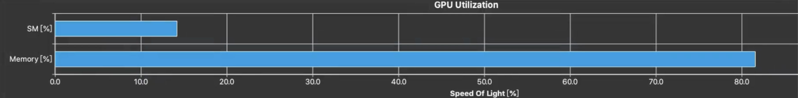

* GPU是如何做矩阵乘法的；
* GPU做运算的效率受到哪些因素的制约（想写出充分发挥GPU能力的程序，需要从哪些方面优化）；
* 如何实际测试一个GPU程序的性能；
* Triton语言相比CUDA，优缺点是什么；
* 使用Triton编写一个矩阵乘法算法，针对多种不同规模的矩阵乘，性能要求不低于pytorch自带的矩阵乘法实现。记录下每一步优化过程。

## 1 GPU是如何做矩阵乘法

### 1-1 矩阵乘法是什么？

矩阵A(M行K列) 乘 矩阵B(K行N列) 等于 矩阵C(M行N列)；矩阵A中第m行的元素和矩阵B中第n列的元素对应相乘，再对这些乘积求和就是矩阵C中第m行n列的元素；

输入：矩阵A(M行K列) 和 矩阵B(K行N列)；输出：矩阵C(M行N列)；

程序需要做的事：求出矩阵C中每个元素的值[m,n] -> 对于k从0到K-1，求A[m][k] 乘 B[k][n]，最终把这些乘积相加，即得到C[m][n]。

### 1-2 CPU如何做矩阵乘法？

串行实现：最直接的是三重循环，依次计算矩阵C的每个元素；

并行化思路：矩阵C的各元素计算彼此独立，天然适合并行。常见做法包括：

* 多线程（如 OpenMP）：把 M×N 个输出元素的计算分给不同线程；
* 分布式（如 MPI）：把矩阵分块到多台机器协同计算。

### 1-3 GPU如何做矩阵乘法？

CPU追求低延迟与强单核，核心复杂（分支预测、乱序、多级缓存），面积和功耗高，难以大规模堆核，整体并行度受限；

GPU追求高吞吐，执行单元更简单、易于堆叠成千上万的并行通道，并行度显著更高，更适合大规模并行计算；

## 2 GPU做运算的效率收到哪些因素的制约

GPU擅长大量线程并行计算，但在计算开始前，需要先从显存或更低层存储中加载数据。运算效率很大程度上依赖于所需数据是否已提前放入共享内存或寄存器等高速存储中。

* 把数据尽早、成批搬到更近的存储层（寄存器/共享内存/缓存），并尽量重复利用；
* 用更多并发在等待期间做别的活儿，隐藏内存延迟。

这里有一些优化思路(NVIDIA GPU)：

* 内存合并：同一warp内的线程若访问连续且对齐的地址，硬件能把它们合并成更少的内存事务；否则会拆成多次事务，放大延迟与带宽占用；
* 分块(tiled)：为了提高数据复用性，可以对要计算的任务进行分块处理；
* 常量内存：对只读且被所有线程统一访问的数据(比如卷积核)，可以放在常量内存(constant memory)里面；
* 延迟隐藏：启动kernel函数时可以设置远超物理核心数的线程，这样当一个warp在等待数据时，GPU调度器会立刻切换到另一个就绪的warp去执行计算；
* 寄存器使用限制：寄存器是线程私有，如果一个线程使用过多的寄存器，会导致并行化程度不高，因为一个SM上的寄存器数是有限的，当单个线程使用过多寄存器时，意味着线程数会减少；
* 分支发散：同一个warp(32个线程)共用一个程序计数器，这意味着同一时刻，一个warp内的线程一定是在执行同一条指令，如果要执行的程序存在分支语句，且同一warp内有两组线程分别走向不同的分支，那么总的执行市场并不是执行时间最长的那个分支，而是两个分支执行时间的总和，即两个分支会顺序执行；这是通过分支掩码来实现的，管理哪个线程活跃/屏蔽；尽量让分支条件与线程组织一致（使warp内走同一分支）；
* 同步：当多个线程需要更新同一个内存地址时(比如累加到一个全局变量)，需要通过原子操作来保证正确性，会导致串行化与争用。

数据应该"取得对"、"取得齐"、"取得早"；取完之后应该"多次用"、“少同步"；同时用足够的并发把延迟藏起来。

## 3 如何实际测试一个GPU程序

首先使用Nsight System从系统层面分析程序，优化不必要同步、数据传输等，接下来使用Nsight Compute对kernel进行分析和优化。

Nsight System：

* 支持NVTX插桩，方便定位性能瓶颈；
* 关注API、kernel函数、内存操作等统计信息：
  * API：cudaDeviceSynchronize、cudaLaunchKernel等；
  * kernel函数：执行时间；
  * 内存操作：host和device之间的数据搬运次数和时长；

Nsight Compute：

* 支持多个event, metric, section；
* 判断是compute/memory/latency bound中的哪一种，查看SOL Section；

* Compute Workload Analysis：各个pipeline的利用率，可以定位是卡在哪个计算环节了(fma, lsu等\)；
* Scheduler Statistics Analysis：反应每次调度发射的warp数占理论值的百分比；
* Warp State Statistics Analysis：反映了warp被stall的原因；
* Memory Wordload Analysis：L1/L2 命中率、带宽利用率、bank conflicts等；
* Launch Statistics Analysis：每个线程用了多少寄存器，共享内存的访问情况等；
* Source Conters Statistics Analysis：哪条指令执行次数最多、哪里出现了非合并访问等；
