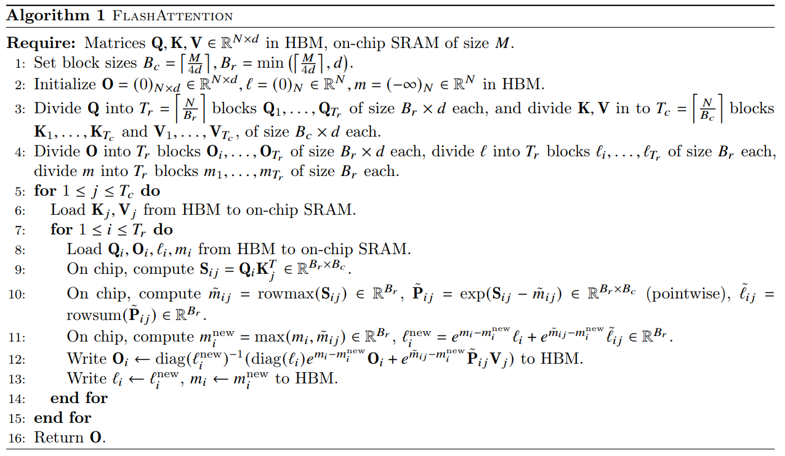
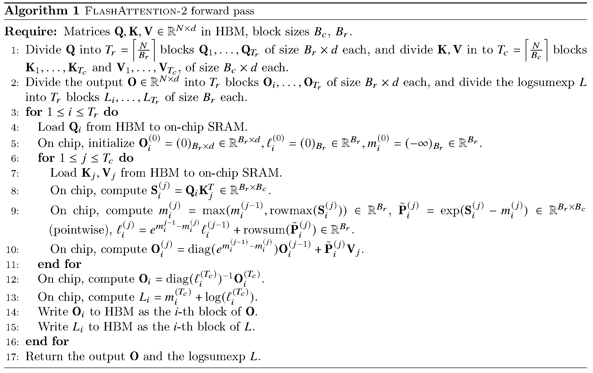

# FlashAttention

## Standard Attention


在介绍FlashAttention之前，需要先说一下Standard的Attention是怎么实现的：

* 首先从HBM里面分块加载Q和K并计算S，然后会把S逐块写回HBM，此时HBM里面存放的有完整的S；
* 其次从HBM里面加载S，对S做softmax得到P，把P写回HBM，此时HBM里面存放的有完整的P；
* 之后从HBM里面分块加载P和V并计算O，然后会把O逐块写回HBM，此时HBM里面存放的有完整的O。

上述过程，产生了大量对慢速HBM的读写操作(S和P在SRAM和HPM之间的传输)，计算受到HBM带宽限制，计算单元等待数据时间长。

## FlashAttention 1



目标：减少对HBM的内存读写操作

FlashAttention是这么做的：

* 在HBM里面初始化m和l这两个辅助计算P和O的变量，然后对m、l、Q、K、V进行分块(K和V是Tc块，m、l和Q是Tr块)，确保SRAM能够装下计算一个小块O所需要的数据；
* 外循环，循环遍历Tc，把相应的K和V小块从HBM加载到SRAM里面；
* 内循环，循环遍历Tr，把相应的O、Q、m和l小块从HBM加载到SRAM里面；
* 通过K和V小块计算出S小块，存在SRAM里面，不写回HBM；
* 通过S小块计算出辅助变量，并利用它们来在线更新O、m和l小块，将结果写回HBM。

整个过程，只有最初和最末涉及对HBM的读写操作，通过在线Softmax和增量更新实现了内存读写次数的减少。

整体上来看，FlashAttention并没有一下子把所有S全计算完，而是只计算S小块，然后借助m和l来实现在线softmax和动态更新O小块这个过程，这样减少了SRAM和HBM之间的数据传输；虽然相比于Standard多了对m、l和O的动态更新计算，但是相比于内存访问，这点时间不算什么。

## FlashAttention 2

1.减少非矩阵乘浮点计算量；2.沿序列长度并行化；3.减少线程块内各warp之间的通信代价



### 1 减少非矩阵乘法运算

为啥要减少非矩阵乘法运算？GPU有专门计算矩阵乘法的硬件单元，1次非矩阵乘法运算的成本相当于16次矩阵乘法运算(A100 GPU)。

flash2相比于flash1主要做了这么两件事：

* 缩放校正次数的减少：
  * flash1在每个内循环步骤结束后，都会立即对当前的部分输出Oi进行缩放校正，这需要进行Tc次非矩阵乘法；
  * flash2在所有内循环结束后，对最终的Oi进行1次缩放校正，减少了非矩阵乘法的次数。
* 辅助变量的简化：
  * flash1需要保存两个统计量，最大值m以及指数和l；
  * flash2优化为只保存一个合并的统计量L，不仅减少了内存读写操作，还减少了非矩阵乘法运算次数。

### 2 并行化(block)

flash1的并行化策略是基于Batch和Head这两个维度的，其调度的单元是计算一个完整的注意力头(O)，可以这么理解：

```txt
# 伪代码：flash1的调度策略
for b in range(batch_size):
    for h in range(num_heads):
        # 计算一整个头（即遍历所有的 i 和 j 循环）
        O_bh = flash_attention(Q[b,h], K[b,h], V[b,h]) # <- 这个函数就是flash1里面的Algorithm 1
# 并行任务数 = batch_size * num_heads
```

一个线程块会领取一个(b,h)任务，然后独立地、串行地执行完flash1里面Algorithm1的全部j和i循环，最终得到结果O。

这里有一个问题，当处理长序列时，由于内存限制，Batch和Head的规模往往很小，这导致并行化程度不够，造成计算资源闲置。

flash2在flash1的基础上，做了更细粒度的并行化。不让一个线程块计算一整个注意力头，而是将每个注意力头的计算也并行化(flash1中Algorithm1的过程)，即一个线程块负责计算一个头中的一个序列小块。

这样即使Batch和Head很小，但只要序列长度足够大，就能创造出足够多的并行任务，充分利用计算资源。

```txt
# 伪代码：flash2的调度策略
# 将(b, h, i)三个维度融合成一个总的任务索引
total_tasks = batch_size * num_heads * T_r # T_r 是序列被切成的块数

# 每个线程块根据自己的唯一ID，计算出自己负责哪个(b, h, i)组合
b = ... # 根据线程块ID算出属于哪个batch
h = ... # 根据线程块ID算出属于哪个head
i = ... # 根据线程块ID算出负责哪个Q块

# 这个线程块的任务是：加载Q_i，然后遍历所有的j块
for j in range(T_c):
    # 执行flash1中Algorithm 1的第8-13步的核心计算
    # 计算S_ij, 更新统计量 (m_i, l_i), 更新输出块O_i
# 并行任务数 = batch_size * num_heads * T_r
```

### 3 block内的分工(warp)

假设一个block内有四个warp。

flash1的block内分工是这样的，对于结果O1 O2 O3 O4，每个warp分别计算O1 O2 O3 O4的四分之一，计算完毕后写入共享内存，等所有warp计算完毕后，进行汇总。

这么做有一个问题，存在大量的对共享内存的读写操作以及warp间同步操作，很耗时。

flash2是这么做的，对于结果O1 O2 O3 O4，每个warp分别结算Oi，这样完全避免了warp之间的通信和同步。

实现方法就是，原本flash1采用的外循环是K和V，内循环是Q，计算Oi的每一小部分；改为flash2的外循环是Q，内循环是K和V，计算一个完整的Oi。
