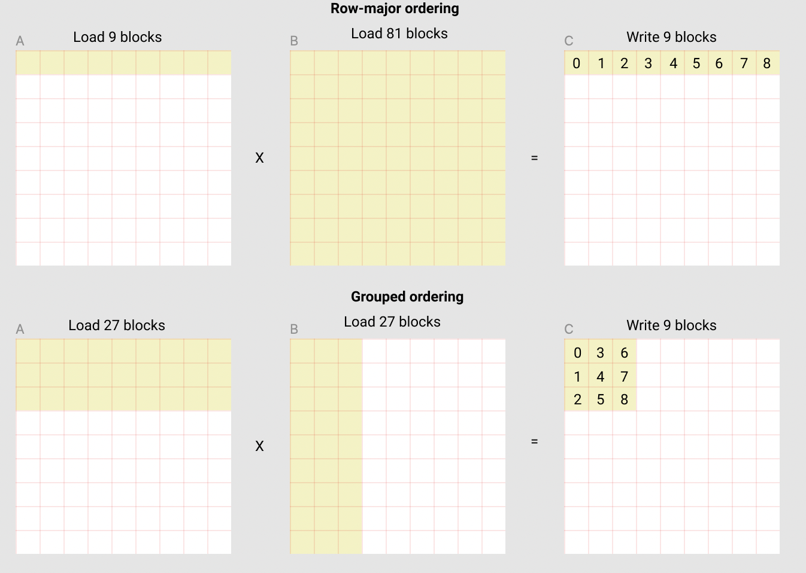

# matmul-triton

[matmul from triton docs](https://triton-lang.org/main/getting-started/tutorials/03-matrix-multiplication.html#sphx-glr-getting-started-tutorials-03-matrix-multiplication-py)

矩阵乘法的应用场景很多，cuBLAS/rocBLAS对矩阵乘法都有实现，但如果想定制矩阵乘法，利用triton实现是一条路。

* 矩阵乘法是怎么计算的？
* 限制矩阵乘法性能的原因是？
* 分块矩阵乘法是什么？
* 如何用triton来实现？

前两个问题先搁置，先看后两个。

---

**分块矩阵乘法是什么？**

为什么要分块？对于大矩阵乘法，数据无法全部装入内存(?)，导致数据频繁换入换出(?)，因而计算速度降低。将大矩阵分成小块，使得要计算的数据能全部装入内存，故而高效。

不分块的方法：一次性装入a(6,4)和b(4,6)矩阵的所有数据并计算

```
|a11 a12 a13 a14|   |b11 b12 ... b16|   |c11 c12 ... c16|
|a21 a22 a23 a24| × |b21 b22 ... b26| = |c21 c22 ... c26|
|... ... ... ...|   |b31 b32 ... b36|   |... ... ... ...|
|a61 a62 a63 a64|   |b41 b42 ... b46|   |c61 c62 ... c66|
```

分块的方法：假设把a分成(3,2)的小块，把b分成(2,2)的小块；那么对于结果c就有(3,2)的小块共6个，每次计算c中的一个小块，只需加载相应的a和b小块数据到内存

```
A矩阵分块 (6×4):
+-------+-------+
| A11   | A12   |  (3×2) (3×2)
| (3×2) | (3×2) |
+-------+-------+
| A21   | A22   |  (3×2) (3×2)
| (3×2) | (3×2) |
+-------+-------+

B矩阵分块 (4×6):  
+-----------+-----------+-----------+
| B11       | B12       | B13       |  (2×2) (2×2) (2×2)
| (2×2)     | (2×2)     | (2×2)     |
+-----------+-----------+-----------+
| B21       | B22       | B23       |  (2×2) (2×2) (2×2)
| (2×2)     | (2×2)     | (2×2)     |
+-----------+-----------+-----------+

C11 = A11*B11 + A12*B21

C矩阵分块 (6×6):  
+-----------+-----------+-----------+
| C11       | C12       | C13       |  (3×2) (3×2) (3×2)
| (3×2)     | (3×2)     | (3×2)     |
+-----------+-----------+-----------+
| C21       | C22       | C23       |  (3×2) (3×2) (3×2)
| (3×2)     | (3×2)     | (3×2)     |
+-----------+-----------+-----------+
```

在分块矩阵乘法中，如何定位每次计算c小块所需的a和b矩阵中的数据的地址是必要的，核心思路是将矩阵转换成一维数组(用行列两维度映射一维数组的一维度)。

分块矩阵乘法就是逐个计算c小块，那么对于上面的例子，c有6个小块，按照什么样的顺序去计算更好呢？官方文档给了这么一张图：



可以看到以grouped ordering的方式去计算c小块，能最大化复用数据。

---

**如何用triton来实现？**

这个在文档里有实现。
