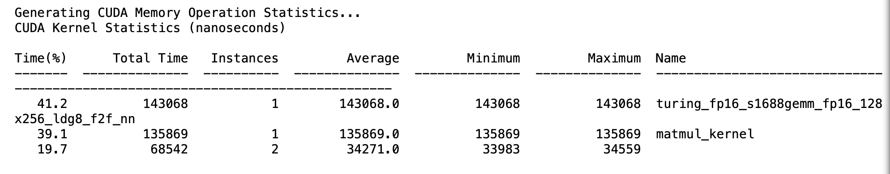

本文档记录nsys分析triton实现矩阵乘的[kernel](pytorch_triton_profile-ncu.py)函数

```
# !nsys profile --stats=true python ./pytorch_triton_profile-ncu.py的结果
**** collection configuration ****
	force-overwrite = false
	stop-on-exit = true
	export_sqlite = true
	stats = true
	capture-range = none
	stop-on-range-end = false
	Beta: ftrace events:
	ftrace-keep-user-config = false
	trace-GPU-context-switch = false
	delay = 0 seconds
	duration = 0 seconds
	kill = signal number 15
	inherit-environment = true
	show-output = true
	trace-fork-before-exec = false
	sample_cpu = true
	backtrace_method = LBR
	wait = all
	trace_cublas = false
	trace_cuda = true
	trace_cudnn = false
	trace_nvtx = true
	trace_mpi = false
	trace_openacc = false
	trace_vulkan = false
	trace_opengl = true
	trace_osrt = true
	osrt-threshold = 0 nanoseconds
	cudabacktrace = false
	cudabacktrace-threshold = 0 nanoseconds
	profile_processes = tree
	application command = python
	application arguments = ./pytorch_triton_profile-ncu.py 
	application working directory = /dli/task
	NVTX profiler range trigger = 
	NVTX profiler domain trigger = 
	environment variables:
	Collecting data...
	Generating the /dli/task/report1.qdstrm file.
	Capturing raw events...
	11772 total events collected.
	Saving diagnostics...
	Saving qdstrm file to disk...
	Finished saving file.


Importing the qdstrm file using /opt/nvidia/nsight-systems/2019.5.2/host-linux-x64/QdstrmImporter.

Importing...

Importing [==================================================100%]
Saving report to file "/dli/task/report1.qdrep"
Report file saved.
Please discard the qdstrm file and use the qdrep file instead.

Removed /dli/task/report1.qdstrm as it was successfully imported.
Please use the qdrep file instead.

Exporting the qdrep file to SQLite database using /opt/nvidia/nsight-systems/2019.5.2/host-linux-x64/nsys-exporter.

Exporting 11759 events:

0%   10   20   30   40   50   60   70   80   90   100%
|----|----|----|----|----|----|----|----|----|----|
***************************************************

Exported successfully to
/dli/task/report1.sqlite

Generating CUDA API Statistics...
CUDA API Statistics (nanoseconds)

Time(%)      Total Time       Calls         Average         Minimum         Maximum  Name                                          
-------  --------------  ----------  --------------  --------------  --------------  --------------------------------------------------------------------------------
   75.3      5276119646           3    1758706548.7           15056      5263736693  cudaLaunchKernel                              
   17.3      1212416784           5     242483356.8           12941      1211950858  cudaMalloc                                    
    7.4       521668409           3     173889469.7            1996       309901787  cudaFree                                      
    0.0          563566           1        563566.0          563566          563566  cuModuleLoadData                              
    0.0           28465           1         28465.0           28465           28465  cudaMemcpy                                    
    0.0           28457           1         28457.0           28457           28457  cuLaunchKernel                                
    0.0           19773          18          1098.5             737            2284  cudaEventCreateWithFlags                      
    0.0            3174           3          1058.0            1005            1109  cuInit                                        


Generating CUDA Kernel Statistics...

Generating CUDA Memory Operation Statistics...
CUDA Kernel Statistics (nanoseconds)

Time(%)      Total Time   Instances         Average         Minimum         Maximum  Name                                          
-------  --------------  ----------  --------------  --------------  --------------  --------------------------------------------------------------------------------
   45.3          175132           1        175132.0          175132          175132  matmul_kernel                                 
   37.0          143100           1        143100.0          143100          143100  turing_fp16_s1688gemm_fp16_128x256_ldg8_f2f_nn  
   17.7           68511           2         34255.5           33952           34559                                                


CUDA Memory Operation Statistics (nanoseconds)

Time(%)      Total Time  Operations         Average         Minimum         Maximum  Name                                          
-------  --------------  ----------  --------------  --------------  --------------  --------------------------------------------------------------------------------
  100.0            1504           1          1504.0            1504            1504  [CUDA memcpy HtoD]                            


CUDA Memory Operation Statistics (KiB)

            Total      Operations            Average            Minimum            Maximum  Name                                          
-----------------  --------------  -----------------  -----------------  -----------------  --------------------------------------------------------------------------------
              0.0               1                0.0              0.109                0.0  [CUDA memcpy HtoD]                            


Generating Operating System Runtime API Statistics...
Operating System Runtime API Statistics (nanoseconds)

Time(%)      Total Time       Calls         Average         Minimum         Maximum  Name                                          
-------  --------------  ----------  --------------  --------------  --------------  --------------------------------------------------------------------------------
   50.3     22236616925          31     717310223.4          457443      6881119575  pthread_cond_wait                             
   23.2     10260983072         114      90008623.4           12961       121858924  sem_timedwait                                 
   22.9     10145096747         113      89779617.2           23112       130677871  poll                                          
    2.1       910191939          14      65013709.9           35707       205745286  waitpid                                       
    0.7       326135933        1883        173200.2            1000        35557782  read                                          
    0.4       193118926           6      32186487.7        30883958        34957733  fork                                          
    0.3       147755266        1533         96383.1            1204        19000397  ioctl                                         
    0.0         9303322        4449          2091.1            1004          182802  sched_yield                                   
    0.0         5000908         979          5108.2            2203           28513  open64                                        
    0.0         3562232        1552          2295.3            1003           19122  open                                          
    0.0         2418000         169         14307.7            1023          682003  mmap                                          
    0.0          430705         129          3338.8            1640           13341  mmap64                                        
    0.0          396790          25         15871.6            4117           82239  write                                         
    0.0          290034          10         29003.4            8742          163047  pthread_mutex_lock                            
    0.0          288164           9         32018.2           13119           57552  pthread_create                                
    0.0          285539           5         57107.8           55546           58643  sleep                                         
    0.0          245210          67          3659.9            1025           17170  fread                                         
    0.0          235950          63          3745.2            1024           43505  fclose                                        
    0.0          234750          80          2934.4            1172           16547  fopen64                                       
    0.0          228498          41          5573.1            1188           39235  fopen                                         
    0.0          212626          43          4944.8            1022           28848  munmap                                        
    0.0          201498           2        100749.0           99841          101657  pthread_join                                  
    0.0          146180           7         20882.9           14035           37404  fgets                                         
    0.0          107321          22          4878.2            1344            9884  pthread_cond_signal                           
    0.0           96661          18          5370.1            1430           31142  fwrite                                        
    0.0           82825          15          5521.7            3066           10336  pthread_cond_broadcast                        
    0.0           46334           3         15444.7           10766           17828  fputs                                         
    0.0           46176          12          3848.0            2202            7988  pipe2                                         
    0.0           20502           4          5125.5            2624            7743  getc                                          
    0.0           18970           3          6323.3            3135           12101  putc                                          
    0.0           18217           9          2024.1            1131            3659  mprotect                                      
    0.0           10803           2          5401.5            3949            6854  socket                                        
    0.0            6259           1          6259.0            6259            6259  connect                                       
    0.0            5176           3          1725.3            1658            1820  pthread_mutex_trylock                         
    0.0            3226           3          1075.3            1004            1153  signal                                        
    0.0            2937           2          1468.5            1237            1700  sigaction                                     
    0.0            2688           2          1344.0            1181            1507  dup2                                          
    0.0            2370           2          1185.0            1069            1301  prctl                                         
    0.0            2059           1          2059.0            2059            2059  bind                                          
    0.0            1268           1          1268.0            1268            1268  listen                                        


Generating NVTX Push-Pop Range Statistics...
NVTX Push-Pop Range Statistics (nanoseconds)

```

* cudaLaunchKernel耗时很多，这说明启动kernel时grid设置不合理，这里我调整了grid之后，发现性能优于torch.matmul



个人感觉还是要充分利用autotune机制
